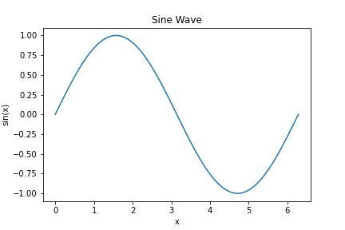

================================
Python Script Example With Image
================================

Here we directly include the script using :language: python directive

.. literalinclude:: PythonExample.py
   :language: python

Here we include the image from the plot by saving the image seperately

 